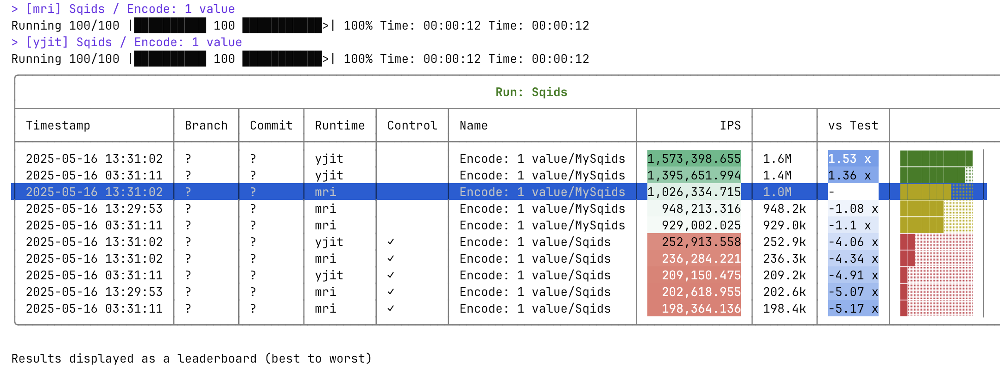

# Awfy (Are We Fast Yet)

A CLI tool for running and comparing Ruby benchmarks across different implementations, runtimes (MRI/YJIT), and git branches or commits.

## Features

- **Multiple Benchmark Types**
  - IPS benchmarks (using [benchmark-ips](https://rubygems.org/gems/benchmark-ips))
  - Memory profiling (using [memory_profiler](https://rubygems.org/gems/memory_profiler))
  - CPU profiling (using [stackprof](https://rubygems.org/gems/stackprof))
  - Flamegraph generation (using [vernier](https://rubygems.org/gems/vernier))
  - YJIT statistics

- **Rich Comparison Features**
  - Compare multiple implementations
  - Compare across git branches or commit ranges
  - Compare with/without YJIT
  - Generate summary reports

- **Persist results**
  - SQLite storage (default)
  - JSON file storage

## Installation

Add to your application:

```ruby
group :development, :test do
  gem "awfy", require: false
end
```

Or install directly:

```bash
gem install awfy
```

## Quick Start

1. Create a benchmark suite directory:

```bash
mkdir -p benchmarks/tests
```

2. Create a setup file (optional):

```ruby
# benchmarks/setup.rb
require "awfy"
require "json"  # Add any dependencies your benchmarks need

# Setup test data or helper methods
SAMPLE_DATA = { "name" => "test", "values" => [1, 2, 3] }.freeze

def create_test_object
  SAMPLE_DATA.dup
end
```

3. Write your first benchmark:

```ruby
# benchmarks/tests/json_parsing.rb
Awfy.group "JSON" do
  report "#parse" do
    # Setup test data
    json_string = SAMPLE_DATA.to_json
    
    # Benchmark standard library as control
    control "JSON.parse" do
      JSON.parse(json_string)
    end
    
    # Benchmark your implementation
    test "MyJSONParser" do
      MyJSONParser.parse(json_string)
    end
  end
end
```

4. Run the benchmark:


For example:

```bash
# Run IPS benchmark
bundle exec awfy ips
# or more explicitly:
# bundle exec awfy ips start JSON "#parse"

# Compare with another branch
bundle exec awfy ips --compare-with=main

# Run without YJIT
bundle exec awfy ips --runtime=mri

# Run benchmark in parallel
bundle exec awfy ips --runner=forked

```

Example output:



## Documentation

For detailed documentation, see:

- [Benchmark Suite Guide](docs/benchmark-suite.md) - How to write benchmarks
- [Configuration Guide](docs/configuration.md) - Configuration options
- [Command Reference](docs/commands.md) - Available commands
- [Advanced Usage](docs/advanced-usage.md) - Advanced features
- [Best Practices](docs/best-practices.md) - Tips and guidelines

## Contributing

Bug reports and pull requests are welcome on GitHub at https://github.com/stevegeek/awfy.

## License

Available as open source under the terms of the [MIT License](https://opensource.org/licenses/MIT).
