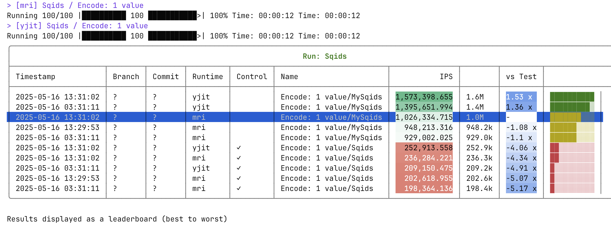

# Awfy (Are We Fast Yet)

A CLI tool for running and comparing Ruby benchmarks across different implementations, runtimes (MRI/YJIT), and git branches or commits.

## Features

- **Multiple Benchmark Types**
  - IPS benchmarks (using [benchmark-ips](https://rubygems.org/gems/benchmark-ips) >= 2.14, < 3.0; from 2.15 the central tendency is the whole-run iterations per second)
  - Memory profiling (using [memory_profiler](https://rubygems.org/gems/memory_profiler))
  - CPU profiling (using [stackprof](https://rubygems.org/gems/stackprof))
  - Flamegraph generation (using [vernier](https://rubygems.org/gems/vernier))
  - YJIT statistics

- **Rich Comparison Features**
  - Compare multiple implementations
  - Compare across git branches or commit ranges
  - Compare with/without YJIT
  - Generate summary reports

- **Persist results**
  - SQLite storage (default)
  - JSON file storage


Example output:



## Installation

Add to your application:

```ruby
group :development, :test do
  gem "awfy", require: false
end
```

Or install directly:

```bash
gem install awfy
```

## Quick Start

1. Create a benchmark suite directory:

```bash
mkdir -p benchmarks/tests
```

2. Create a setup file (optional):

```ruby
# benchmarks/setup.rb
require "awfy"
require "json"  # Add any dependencies your benchmarks need

# Setup test data or helper methods
SAMPLE_DATA = { "name" => "test", "values" => [1, 2, 3] }.freeze

def create_test_object
  SAMPLE_DATA.dup
end
```

3. Write your first benchmark:

```ruby
# benchmarks/tests/json_parsing.rb
Awfy.group "JSON" do
  report "#parse" do
    # Setup test data
    json_string = SAMPLE_DATA.to_json
    
    # Benchmark standard library as control
    control "JSON.parse" do
      JSON.parse(json_string)
    end
    
    # Benchmark your implementation
    test "MyJSONParser" do
      MyJSONParser.parse(json_string)
    end
  end
end
```

4. Run the benchmark:


For example:

```bash
# Run IPS benchmark
bundle exec awfy ips
# or more explicitly:
# bundle exec awfy ips start JSON "#parse"

# Compare with another branch
bundle exec awfy ips --compare-with-branch=main

# Run across a commit range
bundle exec awfy ips start --commit-range="HEAD~5..HEAD" --runner=commit_range

# Run across commits with a specific baseline
bundle exec awfy ips start --commit-range="HEAD~5..HEAD" --runner=commit_range --control-commit=HEAD~5

# Run without YJIT
bundle exec awfy ips --runtime=mri

# Run benchmark in parallel
bundle exec awfy ips --runner=forked

```

Branch and commit-range runs check out other refs in your working tree. awfy stashes uncommitted
changes to tracked files, and afterwards it returns to your branch (or commit) and restores them,
also when a run fails. It refuses to start while a rebase, merge, cherry-pick, revert or bisect is
in progress, or while files are unmerged. `--compare-with-branch` first benchmarks your working
tree as it is, then the named branch, and uses the branch as the baseline.


## Documentation

For detailed documentation, see:

- [Benchmark Suite Guide](docs/benchmark-suite.md) - How to write benchmarks
- [Configuration Guide](docs/configuration.md) - Configuration options
- [Command Reference](docs/commands.md) - Available commands
- [Advanced Usage](docs/advanced-usage.md) - Advanced features
- [Best Practices](docs/best-practices.md) - Tips and guidelines

## Collectors, `run` and `compare`

`awfy run` measures each test of one suite file in-process and stores one `:measure` result per
test under a label. `awfy compare` compares the latest results of two labels.

```bash
awfy run benchmarks/jobs/import.rb --label master@435e4eb4 --store tmp/awfy.db \
  --collectors timing,gc,rss,memory_profiler --vernier --artefacts tmp/artefacts \
  --format json --output tmp/master.json
awfy compare --store tmp/awfy.db --baseline master@435e4eb4 --against fix@2facc52e --format md
```

Passes per test: one untimed warm-up call, pass 1 with every light collector, then one pass per
heavy collector (`memory_profiler`, `vernier`), so heavy collectors never distort the light ones.
Measured calls start after 3x `GC.start`.

| Key | Heavy | Records |
|---|---|---|
| `timing` | no | wall and process CPU seconds |
| `gc` | no | `GC.stat` counter deltas, `malloc_increase_bytes` |
| `rss` | no | RSS MB before, after, after 3x `GC.start` |
| `memory_profiler` | yes | allocated/retained totals and top 25 by gem, file, location, class |
| `vernier` | yes | `<artefacts>/<group>-<report>-<test>.vernier.json.gz` and its sample count |

Suite DSL additions (group or report level; report wins):

```ruby
Awfy.group "Import" do
  setup { }            # once, before the first call
  before_each { }      # before every call, warm-up included (not measured)
  after_each { }       # after every call
  isolate :transaction # :transaction | :none | :snapshot (recorded; the caller restores)
  report "#perform" do
    test("perform") { perform_job(ImportJob) }
  end
end
```

A test block may return an object responding to `awfy_outcome`; compare reports
`outcome_differs` when two labels' outcomes differ, and (when neither label recorded one)
`outcome_recorded: false`. Custom collectors subclass `Awfy::Collector` (`.key`, optional
`.heavy?`, `.order`, `.metrics`, `.extras`; instance `#around`, `#start`, `#stop` returning a
string-keyed Hash) and register with `Awfy::Collectors.register(klass)`. `awfy compare` does
not load the setup file, so a custom collector registered only there is unknown to it: its
results still compare (numeric fields, base/other/delta/pct), but through the default
`Collector.compare`, not any collector-specific one, and its `.extras` are not shown.

`awfy run` saves the run meta (Ruby description, YJIT, awfy version, and with `awfy/rails` the
Rails env, Rails version and jemalloc) with each result. For each test, `awfy compare` lists in
`warnings` each of isolation, runtime and those meta fields that differs between the two labels,
with both values; the Markdown and table output show them under "Environment differs". Results
saved without meta are compared on isolation and runtime only. A collector recorded under one
label only is listed in `collectors_missing`, mapped to that label, instead of being dropped.

`--store` names the SQLite file itself with `--storage-backend sqlite` (the default), and the
directory that holds the `.awfy-result.json` files with `--storage-backend json`. Git is
optional: without it the default label is `unlabelled`.

### Performance assertions

Declare bounds in a group or a report, and `awfy run` checks them after it measures each test:

```ruby
Awfy.group "Orders" do
  assert "sql.queries" => ..5                     # every report of the group
  report "#checkout" do
    assert "memory_profiler.allocated_memsize" => 1_000_000, "timing.wall_s" => 0.01..0.5
    test("checkout") { Order.first.checkout! }
  end
end
```

Keys are `"<collector>.<metric>"` paths into the collected data. A number is an inclusive
maximum, and a Range must cover the value. A report assertion replaces a group assertion on the
same metric. A failed assertion lists the test under `failures` with the metric, the value and
the bound. The result is still saved, and `awfy run` exits 1. An assertion on a collector that
did not run (not in `--collectors`) is also a failure.

## `awfy/rails`

`require "awfy/rails"` (in the setup file) adds Rails collectors and helpers. It does not load
Rails; call `Awfy::Rails.boot!(app_root)` to require `config/environment`.

| Key | Heavy | Records |
|---|---|---|
| `sql` | yes | queries (excluding `SCHEMA`, `TRANSACTION`, cached), cached, `sql_ms`, fingerprints, N+1 candidates (same fingerprint >= `AWFY_N_PLUS_ONE_THRESHOLD`, default 5, from one app frame) |
| `instantiation` | no | records instantiated per class |
| `cache` | no | cache reads, hits, misses, writes; `cas` (keys touched by compare-and-set) and, with IdentityCache, `identity_cache_fetches`, `_keys`, `_memo_hits`, `_hits`, `_misses`, `_resolve_miss_ms`, `_writes`, `_deletes`, `_hydrations` (these keys appear only when such events occur) |
| `sidekiq` | no | jobs enqueued by class and queue, scheduled |

The `identity_cache_*` counts are IdentityCache's own view of its fetches. The store calls it
makes to serve them are also in `reads`/`writes`/`cas`, so do not add the two together.

`sql` gets its own heavy pass: per-query caller capture and backtrace cleaning is expensive
enough that running it in the light pass biased the `timing`/`gc` numbers. Its frame finder
skips this gem's own `lib/` frames so N+1 candidates attribute to the first app frame.

Helpers in suite and test blocks: `perform_job(klass, *args, **kwargs)` (outcome: the `sidekiq`
summary; warns once to stderr if the `sidekiq` collector is not active), `request(verb, path,
host:, headers: {}, params: {}, as: nil, expect: 200..399)` (an integration session; `as:` logs
in through Warden; `expect:` accepts an Integer or a Range; a status outside `expect` raises
`Awfy::UnexpectedStatus`). `isolate :transaction` (the default once `awfy/rails` is loaded and
Active Record is connected) pins a non-joinable transaction per call and rolls it back, as Rails
transactional tests do; `after_commit` callbacks still run.

## Contributing

Bug reports and pull requests are welcome on GitHub at https://github.com/stevegeek/awfy.

## License

Available as open source under the terms of the [MIT License](https://opensource.org/licenses/MIT).
